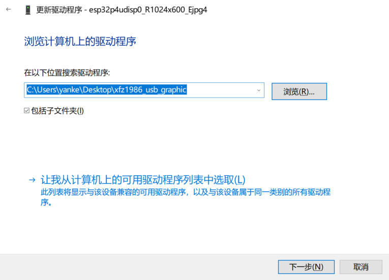

## Windows IDD Driver

The Windows Indirect Display Driver (IDD) model provides a simple user-mode driver model to support monitors that are not connected to a traditional GPU display output. [Reference](https://learn.microsoft.com/en-us/windows-hardware/drivers/display/indirect-display-driver-model-overview)

This driver is based on [chuanjinpang/win10_idd_xfz1986_usb_graphic_driver_display](https://github.com/chuanjinpang/win10_idd_xfz1986_usb_graphic_driver_display). If you need to modify it, download and recompile it yourself.

## Download Link

[Click here to download](https://dl.espressif.com/AE/esp-iot-solution/usb_lcd_windos_driver.zip)

## How to Use

1. (Optional) First, disable Windows driver signature enforcement using test mode.

   * Open the command prompt as an administrator

    ```shell
    bcdedit /set testsigning on
    ```

    

    * Restart your computer. A "Test Mode" watermark will appear in the lower right corner of the desktop.

    

2. Disable Windows signature enforcement for third-party drivers, [Reference](https://answers.microsoft.com/zh-hans/windows/forum/all/%E5%AE%89%E8%A3%85%E9%A9%B1%E5%8A%A8%E7%A8%8B/de380edb-5f62-474e-9820-5663db1af086).

    * Go to `Start` --> `Settings` --> `Windows Update` --> `Recovery` --> `Advanced startup` --> `Restart now`
    * After restarting into recovery mode, click `Troubleshoot` --> `Advanced options` --> `Startup Settings` --> `Restart`
    * After restarting, select `Disable driver signature enforcement` from the startup menu and return to the desktop

3. In Device Manager, select the unrecognized device and install the driver.

    

    * Right-click and select `Update driver`
    * Choose `Browse my computer for drivers`

    

    * Select the folder directory
    * Choose `Always install this driver software`

    

4. After installation, a new display will appear under Display adapters, indicating a successful installation.

    

## Notes

* The device's VID and PID must match the `DeviceName` description in the driver INF file. For composite devices, it must be precise to the interface number, e.g., `USB\VID_303A&PID_2986&MI_00`. Modifying this file requires recompiling the driver.

* The driver communicates with the device through the VENDOR interface, supporting multiple resolutions and image formats, controlled via the interface string descriptor. For details, refer to the [README](https://github.com/chuanjinpang/win10_idd_xfz1986_usb_graphic_driver_display/blob/main/README.md).

* The driver supports only Windows 10 and Windows 11 systems. Please test on other systems independently.